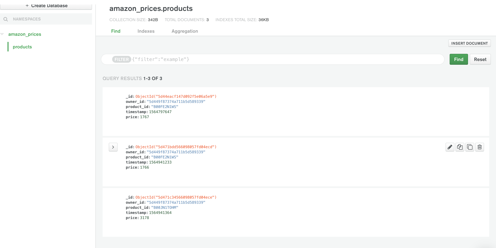

## PriceYak Amazon Checker

This is served like most react apps with `yarn start`(or `npm start` if you dont use yarn).

### Note

I used the MongoDB.com sandbox, but needed to have it accessible from the internet for storage. My solution was to set up MongoDB.com Stitch. 

https://stitch.mongodb.com/

For storage, their sandbox requires a whitelist of an IP for local use. Running `yarn start` works just fine, but if you need to set up your own instance of this
I use the DB name *amazon_prices* with the collection of *products*

